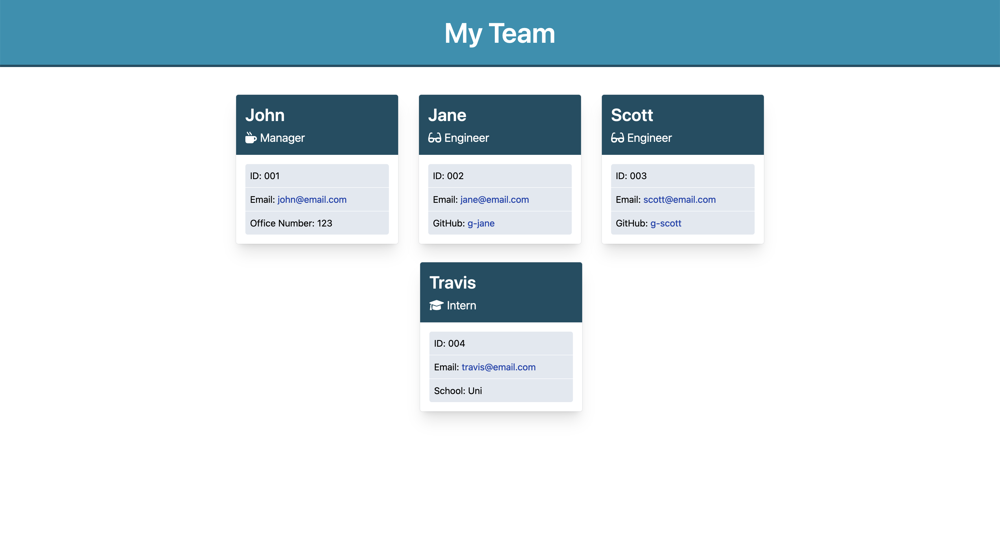

# Team Outline Generator

A Node.js terminal application which prompts you for inputs relating to your team and then generates an HTML with the Team Roster.

- This project was part of a coding bootcamp activity, as homework.
- The user story and acceptance criteria were provided.
- This application uses Node.js (with dependencies)
- Coding this application helped understand how to work with Node (OOP), Dependencies (jest, inquirer, fileSystem, path), TDD (Test Driven Development), Classes and module exports.

## Table of Contents

- [Installation](#installation)
- [Usage](#usage)
- [License](#license)
- [Contributing](#contributing)
- [Tests](#tests)
- [Questions](#questions)

## Installation

1. Clone this repository to your local machine (with node.js pre-installed)
2. Within the root directory, using the terminal install dependencies by running `npm install`
3. Run the application, using your terminal `node index.js`

## Usage

This application is intended to be used for creating professional README.md file for your application repositories, in an interactive way.

**Please refer to the [Video Walkthrough](https://watch.screencastify.com/v/TksIFhVCl6legcNvIDSA)**

## License

This project is covered under: **The Unlicense**

A license with no conditions whatsoever which dedicates works to the public domain. Unlicensed works, modifications, and larger works may be distributed under different terms and without source code.

For license details: [click here](https://choosealicense.com/licenses/unlicense/)

## Contributing

If you're interested in contributing to this project, please clone this repository, make improvements and open a pull request with explanation of the improvements.

## Tests

To test this application, run `npm test` in your terminal.

## Questions

- This project is created and maintained by: [hari-ls](https://github.com/hari-ls)
- If you have addtional questions about this project, please feel free to open an issue using GitHub.
